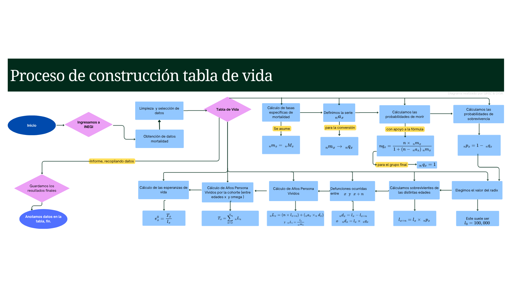

 \definecolor{->}{HTML}{00406d}

# \color{->} 1. Comportamiento de la Mortalidad en Chihuahua {height="1.5em"}

Cada uno de los 32 estados de la República Mexicana tiene diversas caracterisitcas que los vuelve interesantes para el estudio y análisis de los indicadores demográficos de su territorio; así que el estado de Chihuahua, no es la excepción, ya que cuenta con ciertos factores que resaltan en como afectan en la mortalidad de su población.

Chihuahua, famoso por su gran extensión territorial, su ubicación fronteriza con EE.UU. y su dinámica socioeconómica, presenta particularidades contrastantes con el resto del país. Consideramos que desde hace un tiempo, particularmente durante el periodo de tiempo que abarca 2010-2021,la mortalidad en la entidad se ha visto fuertemente influenciada por dos factores: las enfermedades (Tanto crónico-degenerativas, como el COVID-19) y la violencia.

Esta afirmación es fácil de sostener ya que, generalmente en México, las enfermedades del corazón y la diabetes mellitus representan las principales causas de decesos en la población general, sumado al conocido contexto inseguridad principalmente en la zona norte del país. Sin embargo, para darle más peso y respaldo a la suposición planteada, haremos un análisis inicial de la mortalidad en Chihuahua, buscando patrones que nos lleven a resultados clave para el estudio de la mortalidad y su impacto en la población de este territorio.

Para este primer análisis, nos basaremos completamente en los datos de Estadisticas de Defunciones Registradas (EDR) que se encuentran en el sitio oficial del INEGI, primero consideramos relevante el ver como cambia el número de muertes anuales dentro de nuestro periodo de tiempo fijo (Usaremos el periodo 2008-2023 para mejor visualización en los años extremos 2010 y 2021), en este caso graficaremos el número de muertes por año de registro y no de ocurrencia, esto por mayor facilidad y ya que este análisis solo es un esbozo en nuestro intento de comprender cual son los factores más influyentes:

```{r}
#| echo: false
#| warning: false
#| message: false
#| 

library(ggplot2)
library(data.table)

# Cargamos los datos
datos_edr <- fread("data/csv/EDR_Chihuahua_2008-2023.csv")


# Verificamos que el orden de la leyenda para que sea estético (Hombres, Mujeres y luego el Total )
datos_edr$tipo <- factor(datos_edr$tipo, levels = c("Hombres", "Mujeres", "Total"))

# Graficamos las tres categorias para contrastar
ggplot(datos_edr, aes(x = year, y = total, color = tipo, group = tipo)) +
  geom_line(linewidth = 1.2) +
  geom_point(size = 2.5) +
  scale_x_continuous(breaks = seq(min(datos_edr$year), max(datos_edr$year), by = 2)) +
  scale_y_continuous(labels = scales::comma) +
  scale_color_manual(values = c("Hombres" = "#1f77b4", "Mujeres" = "#e377c2", "Total" = "#4d4d4d")) +
  labs(
    title = "Defunciones Registradas en Chihuahua",
    subtitle = "Comparativa histórica por sexo y total",
    caption = paste0("Defunciones registradas en Chihuahua en el periodo 2008-2023.\n", 
                     "El procesamiento de los datos se puede ver a detalle en el documento EDR_Chihuahua_2008-2023.csv"),
    x = "Año",
    y = "Defunciones registradas",
    color = "Categoría"
  ) +
  theme_minimal(base_size = 9) +
  theme(
    plot.title = element_text(face = "bold", size = 12, hjust = 0.5),
    plot.subtitle = element_text(size = 9, hjust = 0.5, color = "gray30"),
    plot.caption = element_text(size = 7, color = "grey40", face = "italic"),
    legend.position = "bottom",
    panel.grid.minor = element_blank()
  )
```

Esta gráfica es una gran herramienta auxiliar ya que nos da mucha información que analizar. Lo primero a notar es que las tres lineas resultantes son muy semejantes, en particular el número de defunciones anuales de mujeres parecen ser un desplazamiento vertical hacia abajo del número de defunciones anuales masculinas(En general, la mayoria de muertes anuales en Chihuahua son de hombres), lo que indica que estas dos varibles tienen una relación, posiblemente lineal; en consecuencia a esto, la suma total de defunciones tiene una forma muy similar a las individuales obviamente con valores más pequeños. Otra cosa a notar es que en practicamente en todos los años, el número de defunciones crece (lo cual es de esperarse ya que la población también lo hace) a una "velocidad" baja a lo largo del tiempo el número, a excepción de un aumento bastante considerable en dos años 2010 y 2020.

El hecho de que haya solo dos años con crecimiento tan abrupto en el número de muertes, nos indica que en esos años sucedió algo atipico, que en caso del 2020 favorece nuestra hipotésis de la pandemia ya que concuerda con el periodo. Sin embargo, para asegurarnos que los factores propuestos en verdad sean los principales que afectan a la población en Chihuahua, habría que hacer un análisis por separado de cada uno para ver si siguen la tendencia de crecimiento visto en las defunciones en genereal, y por ende expliquen dicho comportamiento en los años antes mencionados.

## \color{->} 1.1 El impacto de homicidios en la mortalidad {height="1.5em"}

El caso de los homicidios anuales siempre ha sido una estadistica preocupantemente relevante en las EDR de México; sin embargo, durante un periodo corto de tiempo centrado en el año 2010, se convirtió en una estadistica aún más impactante. La lucha contra el crimen organizado durante esa época llevó a un punto inquietante al Gobierno de México y la población mexicana, en el intento de erradicar grupos criminales, gran parte de la estadistica de muertes por homicido se le atribuye a esta razón.

Lo anterior resulta en un hecho más importante en nuestro análisis ya que, la violencia y ataques causados por esta lucha se vieron focalizados en la zona norte del país por su relación fronteriza con EE.UU. y su relación comercial entre grupos criminales de ambos territorios, según el diario Expansión MX "*A partir de 2007, la frecuencia de los homicidios se dispara para estas entidades federativas, acentuándose en el caso de Chihuahua*". Dichos actos llevaron a reconocidos actos violentos como lo es la masacre de Villas de Salvárcar, que dejo un saldo de homicidios de 16 personas de entre 16-20 años precisamente un 31 de enero de 2010.

Por su parte, desde el año 2016, nuevamente el número de homicidios en el país se vió con importantes cambios. El aumento de homicidios en el país entre 2016 y 2020 fue impulsado principalmente por la fragmentación de los grandes carteles de droga, detonando en una violenta disputa por mercados locales de consumo y rutas de tráfico.Debido a que las razón en escencia fue la misma, la mayoría de dichos homicidios nuevamente se centraron en lugares como Ciudad Juarez en Chihuahua, llevando al Estado a su peor registro durante ese periodo de tiempo en 2020.

A continuación, se hará una gráfica para plasmar los datos del INEGI en Estadísticas de Muerte Registradas (EDR), según por homicidos registrados en Chihuahua, casos registrados en los años del periodo 2008-2023 y por sexo (excluyendo No especificado).

```{r}
#| echo: false
#| warning: false
#| message: false
#| 

library(ggplot2)

# Leemos el archivo
datos <- fread("data/csv/Muertes_por_Homicidia_Chihuahua.csv")
# Graficamos
ggplot(datos, aes(x = year, y = total, color = tipo, group = tipo)) +
geom_line(linewidth = 1.2) +
geom_point(size = 2.5) +
# Configuramos el eje X para que muestre los años de 2 en 2 y se visualice mejor
scale_x_continuous(breaks = seq(min(datos$year), max(datos$year), by = 2)) +
# Asignamos colores para una mejor visualización
scale_color_manual(values = c("mhh" = "#1f77b4", "mhm" = "#e377c2")) +
labs(
title = "Evolución Histórica de Homicidios en Chihuahua",
subtitle = "Comparativa anual por sexo",
caption = paste0("Evolución de muertes por homicidio en Chihuahua según casos registrados.\n", 
                     "El procesamiento de los datos se puede ver a detalle en el documento Muertes_por_Homicidia_Chihuahua.csv"),
x = "Año",
y = "Homicidios registrados",
color = "Indicador"
) +
theme_minimal(base_size = 9) +
theme(
plot.title = element_text(face = "bold", size = 12, hjust = 0.5),
plot.subtitle = element_text(size = 9, hjust = 0.5, color = "gray30"),
plot.caption = element_text(size = 7, color = "grey40", face = "italic"),
legend.position = "bottom",
panel.grid.minor = element_blank()
)
```

Como podemos apreciar, fue una buena idea separar los casos registrados por sexo, ya que podemos apreciar la gran diferencia que existe en homicidios con victimas masculinas y femeninas; incluso veremos que en los años con mayor número de homicidios en el caso de victimas masculinas la gráfica se ve disparada, y en el caso de victimas femeninas apenas se ve afectada o incluso no sigue una tendencia creciente. Esto último respercutirá en la esperanza de vida de los hombres, siguiendo esta línea, faltaría analizar como se concentra esta mortalidad por homicidios en las edades de la victima. A continuación, plasmaremos dichos datos en histogramas que tomaran periodos quinquenales (jutando también el periodo 0-1 y 1-4 para que cada clase tenga el mismo periodo de tiempo) siguiendo los datos consultados en el INEGI.

```{r}
#| echo: false
#| warning: false
#| message: false
#| fig-subcap: 
#|   - "Hombres"
#|   - "Mujeres"
#| layout-ncol: 2
#| 
library(ggplot2)
library(dplyr)

datos_edad <- fread("data/csv/Muertes_Homicidios_por_edad_Chihuahua.csv")
datos_edad$edad <- factor(datos_edad$edad, levels = unique(datos_edad$edad))

# Gráfica para Hombres
datos_edad %>% 
  filter(sexo == "hombre") %>% 
  ggplot(aes(x = edad, y = total)) +
  geom_col(fill = "#1f77b4", color = "white", alpha = 0.8) +
  labs(
    title = "Distribución de Muertes por Homicidio.",
    subtitle = "Para Hombres en Chihuahua",
    caption = paste0("Distribución de homicidios registrados en periodos quinquenales.\n", 
                     "El procesamiento de los datos se puede ver a detalle en el documento Muertes_Homicidios_por_edad_Chihuahua.csv"),
    x = "Grupos de Edad",
    y = "Total de Homicidios") +
  theme_minimal(base_size = 9) +
  theme(
    plot.caption = element_text(size = 7, color = "grey40", face = "italic"),
    axis.text.x = element_text(angle = 45, hjust = 1),
    panel.grid.minor = element_blank()
  )

# Gráfica para Mujeres
datos_edad %>% 
  filter(sexo == "mujer") %>% 
  ggplot(aes(x = edad, y = total)) +
  geom_col(fill = "#e377c2", color = "white", alpha = 0.8) +
  labs(
    title = "Distribución de Muertes por Homicidio.",
    subtitle = "Para Mujeres en Chihuahua",
    caption = paste0("Distribución de homicidios registrados en periodos quinquenales.\n", 
                     "El procesamiento de los datos se puede ver a detalle en el documento Muertes_Homicidios_por_edad_Chihuahua.csv"),
    x = "Grupos de Edad", 
    y = "Total de Homicidios") +
  theme_minimal(base_size = 9) +
  theme(
    plot.caption = element_text(size = 7, color = "grey40", face = "italic"),
    axis.text.x = element_text(angle = 45, hjust = 1),
    panel.grid.minor = element_blank()
  )
```

En estas gráficas podemos apreciar que la forma en la que se distribuyen las edades de victimas por homicidio entre hombres y mujeres es muy parecida, enfatizamos que se parecen en forma; ya que, no podriamos decir que son muy parecidas en general porque las escalas del eje $y$ entre ambas gráficas es diferentes, esto por lo visto anteriormente entre la gran diferencia en cantidad de victimas por cada sexo. Dejando esto a un lado, es fácil ver que gran parte de las victimas por homicidio se concentran entre las edades 25 a 34 años para ambos sexos, también podemos notar que la proporción de mujeres fallecidas por homicidios de 0-14 años es mayor a la proporción de hombres que murireron por homicidio del mismo rango de edad. Todos estos factores contribuiran en la modificación de indicadores como la esperanza de vida y años-persona vividos que veremos más adelante y analizaremos al final de este documento.

## \color{->} 1.2 El impacto de las enfermedades en la Mortalidad {height="1.5em"}

En el caso de la Mortalidad por Enfermedades en Chihuahua en el periodo 2008-2023, los datos muestran que en los años 2008 a 2019 existe un crecimiento poco importante; ya que, es de esperarse que la cantidad de muertes por cualquier causa persistente en el tiempo (como son las enfermedades) aumente, esto debido a que si la población va en crecimiento, también la cantidad de personas que mueren lo hara (al menos en condiciones normales). Sin embargo, donde si se tienen cambios considerables a analizar, es lo que sucede en el periodo a partir de 2020, pues en estos años se presenta un crecimiento que supera a la tendencia que se estaba siguiendo en el periodo antes mencionado.

Es natural pensar que el suceso que causó tal aumento sea la llegada de la pandemia por *Covid-19*. Para verificar si esto es correcto analizaremos las Estadísticas de Defunciones registradas; esta vez, filtraremos los datos por las muertes registradas en Chihuahua en el periodo 2008-2023, por sexo, edad y tomando en cuenta como causa de muerte las 48 distintas enfermedades que contempla la lista mexcicana de enfermedades (En dicha lista esta (01) Enfermedades infecciosas intestinales, (02) Tuberculosis, (03) Otras enfermedades bacterianas, (04) Infecciones con modo de transmisión predominantemente sexual, (05) Otras enfermedades infecciosas y parasitarias y efectos tardíos de las enfermedades infecciosas y parasitarias, etc). Con estos datos notamos que el año con mayor número de defunciones por enfermedades fue el 2020, asi que buscaremos obtener las principales enfermedades dentro de las 48 definidas para ese año en particular, obteniendo la siguiente tabla: **Tabla 1:** Principales Causas de Enfermedad y Mortalidad por Sexo (2020)

```{r}
#| echo: false
#| warning: false
#| message: false
#| fig-pos: 'H' #| label: tbl-enfermedades #| tbl-cap: "Principales Enfermedades en la Mortalidad por Sexo (2020)"
#| 
library(kableExtra)
library(dplyr)

# Cargamos los datos de nuestro archivo
datos <- fread("data/csv/Principales_Enfermedades.csv", check.names = FALSE)

# Damos formato a los datos para visualizarlos mejor, como poner la proporcion en porcentaje
datos_formateados <- datos %>%
  mutate(
    `No. Muertes` = format(`No. Muertes`, big.mark = ","),
    `Proporcion de muertes de la enfermedad` = paste0(round(`Proporcion de muertes de la enfermedad` * 100, 1), "%"),
    `Proporcion de muertes` = paste0(round(`Proporcion de muertes` * 100, 1), "%")
  )

# 4. Generar la tabla con kableExtra
datos_formateados %>%
  kbl(
    align = "clllcll",
    col.names = c("Año", "No. Muertes", "Sexo", "Enfermedad", "Ranking", "% Enfermedad", "% Total"),
    format = "latex",    # Forzamos formato LaTeX explícito
    table.env = "table"
  ) %>%
  kable_styling(
    latex_options = c("striped", "scale_down", "HOLD_position"),
    full_width = FALSE,
    position = "center",
    font_size = 9
  ) %>%
  row_spec(0, bold = TRUE, color = "white", background = "#00406d") %>%
  footnote(
    general = "El procesamiento de los datos para esta tabla se puede ver a detalle en el documento Muertes_por_Enfermedad_Chihuahua.xlsx",
    general_title = "Nota: ",
    footnote_as_chunk = TRUE
  )
```

En la columna "*Enfermedad*" de esta tabla podemos apreciar las tres enfermedades que más muertes provocaron para cada sexo, en la columna "*No. Muertes*" podemos ver el número de muertes que provocaron y en las últimas dos columnas podemos ver el pocentaje que dicha enfermedad representa en el número de muertes por enfermedad y el número de muertes general respectivamente.

En la tabla vemos que tanto para hombres como mujeres en 2020, la principal categoría que derivo en muerte fue enfermedades viricas, lo que no nos asegura que todas o la mayoría sean por *Covid-19*; asi como no nos asegura que las muertes por otras enfermedades no hayan sido por complicaciones por *Covid-19* o por falta de atención médica por la cuarentena durante la pandemia, pero es algo que se puede inferir por tratarse de un valor atipico respecto a años anterirores. Por su parte, las enfermedades que toman el segundo y tercer puesto en la tabla son las mismas para hombres y mujeres siendo *Enfermedades isquemicas del corazón* y *Enfermedades endocrinas y metabolicas* respectivamente, estas dos suelen ocupar los primeros puestos en los periodos anteriores a 2020, pero así como el *Covid-19* desencadeno en otros padecimientos que luego causaron la muerte, las personas con este tipo de enfermedades se vieron más vulneradas que las personas sanas lo que explicaría en gran medida el porque tan solo las tres principales causas de muerte por enfermedad representen el $43.1\%$ del total de muertes en 2020 para hombres y el $47.6\%$ para mujeres. Ahora con esto en mente, visualicemos los datos de muertes en Chihuahua durante e periodo 2008-2023.

```{r}
#| echo: false
#| warning: false
#| message: false
#| 
library(ggplot2)

# Leemos el documento
datos_enfermedad <- fread("data/csv/Muertes_por_Enfermedad_Chihuahua.csv")


# Graficamos tanto para hombres como mujeres para ver el contraste
ggplot(datos_enfermedad, aes(x = year, y = total, color = sexo, group = sexo)) +
  geom_line(linewidth = 1.2) +
  geom_point(size = 2.5) +
  scale_x_continuous(breaks = seq(min(datos_enfermedad$year), max(datos_enfermedad$year), by = 2)) +
  scale_color_manual(values = c("Hombres" = "#00406d", "Mujeres" = "#e377c2")) +
  labs(
    title = "Evolución de Muertes por Enfermedad en Chihuahua",
    subtitle = "Comparativa histórica entre Hombres y Mujeres",
    caption = paste0 ("Las muertes por enfermedades por sexo\n", 
                     "El procesamiento de los datos se puede ver a detalle en el documento Muertes_por_Enfermedad_edad_Chihuahua.csv"),
    x = "Año",
    y = "Total de Defunciones",
    color = "Sexo"
  ) +
  theme_minimal(base_size = 11) +
  theme(
    plot.title = element_text(face = "bold", size = 12, hjust = 0.5),
    plot.subtitle = element_text(size = 9, hjust = 0.5, color = "gray30"),
    plot.caption = element_text(size = 7, color = "grey40", face = "italic"),
    legend.position = "bottom",
    panel.grid.minor = element_blank()
  )
```

Lo primero destacable, es que a diferencia de la misma gráfica para *Evolución Histórica de Homicidios en Chihuahua*, las gráficas para hombre y para mujer se parecen muchisimo más entre si, siendo practicamente un desplazamiento hacia arriba la gráfica para hombres de la de mujeres. Esto, explicaría el gran parecido entre las gráficas de hombre y mujer en la gráfica *Defunciones Registradas en Chihuahua*, ya que si las gráficas de muertes registradas por enfermedad se parecen mucho, y dicha causa de muerte es la más común con diferencia en la población, entonces las gráficas de muertes registradas en total también seran parecidas entre si, y las variaciones que haya entre ambas gráficas seran totalmente dependientes a las otras causas de muerte como homicido; es por eso, que si vemos otra vez la gráfica de *Defunciones Registradas en Chihuahua*, donde existe mayor diferencia en la forma de gráficas entre sexos es en el año 2010, precisamente, el año en que mayor diferencia hay entre las gráficas de sexo de *Evolución Histórica de Homicidios en Chihuahua*.

Por otro lado, como ya se habia mencionado, logramos ver que antes de 2020 la tendencia se había mantenido a un crecimiento muy lineal, pero teniendo en cuenta un crecimiento tan irregular en 2020 y que la razón principal hayan sido enfermedades viricas, se entiende el impactante factor que se volvio el *Covid-19* y como esto repercutirá en la esperanza de vida.

Finalmente, como en el caso de muertes registradas por homicidio, generaremos histogramas para ver como se distribuyen la muertes por enfermedad por edades en el periodo seleccionado.

```{r}
#| echo: false
#| warning: false
#| message: false
#| fig-subcap: 
#|   - "Hombres"
#|   - "Mujeres"
#| layout-ncol: 2

# 1. Cargar librerías necesarias
library(ggplot2)
library(dplyr)

# Leemos los datos obtenidos de INEGI
datos_enfermedad_edad <- fread("data/csv/Muertes_por_Enfermedad_edad_Chihuahua.csv")
datos_enfermedad_edad$edad <- factor(datos_enfermedad_edad$edad, levels = unique(datos_enfermedad_edad$edad))

# Histograma para Hombres
datos_enfermedad_edad %>% 
  filter(sexo == "Hombres") %>% 
  ggplot(aes(x = edad, y = total)) +
  geom_col(fill = "#00406d", color = "white", alpha = 0.85) +
  labs(
    x = "Grupos de Edad", 
    y = "Total de Defunciones"
  ) +
  theme_minimal(base_size = 9) +
  theme(
    axis.text.x = element_text(angle = 45, hjust = 1),
    panel.grid.minor = element_blank()
  )

# Histograma para Mujeres
datos_enfermedad_edad %>% 
  filter(sexo == "Mujeres") %>% 
  ggplot(aes(x = edad, y = total)) +
  geom_col(fill = "#e377c2", color = "white", alpha = 0.85) +
  labs(
    x = "Grupos de Edad", 
    y = "Defunciones por enfermedad"
  ) +
  theme_minimal(base_size = 9) +
  theme(
    axis.text.x = element_text(angle = 45, hjust = 1),
    panel.grid.minor = element_blank()
  )
```

Nuevamente, existe cierto parecido en la forma de los histogramas, pero esta vez también se parecen en dimensiones, ya que si bien existe diferencia en el número de hombres y mujeres que mueren por enfermedad, no es tan marcado como en la causa de muerte homicidios; por ende, contamos con la misma escala en los ejes $y$ pero sigue existiendo diferencia de magnitud. Podemos apreciar que en el caso de mujeres, seis grupos de edad superan las 10,000 defunciones, mientras que para hombre lo hacen ocho grupos de edad, para los primeros grupos de edad de cada sexo, vemos una cantidad considerablemnte grande pero esperada de muertes. Para los hombres, a partir de ahi, se sigue un crecimiento creciente a excepción del penúltimo grupo donde baja un poco para volver a subir en el último, lo cual se púede considerar un comportamiento normal, mientras que para las mujeres, el crecimiento hasta el penúltimo grupo es creciente pero más bajo que para los hombres, es hasta el último grupo donde hay un crecimiento bastante diferencial que incluso supera el de cualquier grupo de los hombres; pero es de esperarse ya que, si el porcentaje de población masculina y femenina es practicamente el mismo, no existe gran diferencia entre el número de muertes por enfermedad entre sexos y las enfermedades son la principal causa de muerte representando casi el mismo porcentaje para ambos sexos, la cantidad de defunciones por esta razón se debe ver compensada en algún punto (siendo el último grupo en las mujeres), pero esto se espera que repercuta positivamente en la esperanza de vida femenina.

# \color{->} 2. Tablas de vida {height="1.5em"}

Una vez visto los principales factores que alteran la Mortalidad en la región, buscaremos realizar las tablas de vida para los años 2010,2019 y 2020. Las tablas de vida son un recurso muy importante por su versatilidad y comodidad para plasmar una cantidad enorme de información en un solo medio; sin embargo, no son fáciles de interpretar por lo mismo, asi que en esta parte del trabajo explicaremos el proceso para obtener una tabla de vida, y analizaremos los aspectos más relevantes que estas contengan.

## \color{->} 2.1. Procesamiento de los datos {height="1.5em"}

Un censo es un recuento detallado de todos los individuos que componen una población, por lo que, es de vital importancia para múltiples recursos demográficos; en particular, para una *Tabla de Vida*. En México, contamos con un organismo que dentro de otras funciones, se encarga de la recopilación y publicación de los datos censales, dicho esto, nos ayudaremos de los censos poblacionales hechos por el INEGI en 2010 y 2020, y los consultaremos desde su sitio oficial.

Mediante la consulta del INEGI, obtendremos los datos de población total por sexo y edad que vivian en Chihuahua a fecha del respectivo censo, estos datos aunque son de gran ayuda, tienen un pequeño error de captura al momento de la consulta, pues para parte de los individuos del recuento se tienen una clasificación de edad o sexo "*No especificada*", por lo que para evitar estos datos faltante se realiza un prorrateo por sexo de la siguiente forma: $$p_{\text{masculina total}} = P_{\text{masculina original}} + \omega_m \cdot p_{\text{no especificado}}$$ $$p_{\text{femenina total}} = P_{\text{femenina original}} + \omega_f \cdot p_{\text{no especificado}}$$

Donde los términos $\omega$ corresponden a las proporciones de cada sexo:

$$\omega_m = \frac{P_{\text{masculina original}}}{P_{\text{masculina original}} + P_{\text{femenina original}}}$$ Una vez obtenidos los datos de población total por sexo se busca obtener el valor de los años-persona vividos, que se interpretan como los años totales que contribuye una cohorte al total de años que se pueden vivir en un periodo determinado, para ello ocupamos dos cosas. Primero debemos obtener el valor que mide el tiempo que hubo entre los censos, pa esto debemos usar las fechas de los censos 2010 y 2020 y pasarlos a decimales mediante la fórmula: $$ Fecha=Año + \dfrac{(Mes-1)}{12}+\frac{Dia}{365} $$ Entonces obtenemos el valor absoluto de la diferencia de las fechas censales y lo llamamos $\Delta_t$, ahora calculamos las tasa $r$, con la siguiente fórmula: $$r = \frac{\ln\left(\frac{N_T}{N_0}\right)}{\Delta t}$$ Con estos datos, ahora podemos calcular los valores $APV$, usando la fórmula de crecimiento exponencial: $$ N(t)=N(0)\cdot exp(rt) $$ Pero modificandola como una proyección a mitad de año: $$ APV(T)=N(t)\cdot exp(\Delta_t\cdot(T-t)) $$ con $t$ la fecha del primer censo considerado y $T$ la mitad del año en el que se miden los $APV$. Para continuar con la construcción de las tablas de vida debemos nuevamente consultar la página oficial del INEGI en el apartado Estadísticas de Defunciones Registradas (EDR) para obtener el número de muertes totales para cada unos de los años (2010,2019,2021) por edad y sexo, pero esta vez buscamos las muertes por año de ocurrencia y no de registro. Una vez obtenidos los $_nAPV_x$ y $_nD_x$, solo queda hacer su cociente para tener las tasas especificas de mortalidad: $${}_nm_x=\dfrac{_nAPV_x}{_nD_x}$$ Estos valores ya se pueden usar para obtener una tabla de vida mediante el algoritmo usual. En nuestro caso la obtencion de los valores $_nm_x$ se puede ver a detalle en los archivos "*APV-R-Demografia-GHJZ-LVSK.xlsx*" y "*TasasMortalidad_Demografia_GHJZ-LVSK.xlsx*"

## \color{->} 2.2 Fórmulas para la Tabla de Vida Abreviada {height="1.5em"}

La tabla de vida es un cuadro estadístico que estudia la mortalidad en una cohorte hipotética de $l_0 = 100,000$ nacidos vivos para observar su extinción gradual bajo las tasas de mortalidad calculadas ($_{n}m_x$). Las fórmulas que se ocupan para su construcción son:

1.  **Probabilidad de muerte (**$_{n}q_x$): Traduce la tasa central de mortalidad en la probabilidad de que un individuo de edad exacta $x$ muera antes de cumplir $x+n$ años.

$$_{n}q_x = \frac{n \cdot _{n}m_x}{1 + (n - _{n}a_x) \cdot _{n}m_x}$$

*Nota:* $_{n}a_x$ representa los años promedio vividos por quienes fallecen en ese intervalo.

2.  **Probabilidad de supervivencia (**$_{n}p_x$): El complemento de la probabilidad de morir.

$$_{n}p_x = 1 - _{n}q_x$$

3.  **Sobrevivientes (**$l_x$): Número de personas que logran llegar vivas a la edad exacta $x$.

$$l_{x+n} = l_x \cdot _{n}p_x$$

4.  **Defunciones teóricas (**$_{n}d_x$): Muertes esperadas dentro de la cohorte en el intervalo $(x, x+n)$.

$$_{n}d_x = l_x - l_{x+n} = l_x \cdot _{n}q_x$$

5.  **Años persona vividos en el intervalo (**$_{n}L_x$): Tiempo total acumulado por la cohorte entre las edades $x$ y $x+n$.

$$_{n}L_x = (n \cdot l_{x+n}) + (_{n}a_x \cdot _{n}d_x)$$

Para el último grupo abierto (edad avanzada $\omega$), se asume que todos mueren ahí, calculándose como:

$$_{\infty}L_{\omega} = \frac{l_{\omega}}{_{\infty}m_{\omega}}$$

6.  **Años persona vividos acumulados (**$T_x$): Tiempo total que le resta por vivir a la cohorte a partir de la edad $x$.

$$T_x = \sum_{i=x}^{\omega} {}_{n}L_i$$

7.  **Esperanza de vida (**$e_x$): El promedio de años que le restan por vivir a una persona que ha alcanzado la edad exacta $x$.

$$e_x = \frac{T_x}{l_x}$$

## \color{->} 2.3 Diagrama de flujo de la construcción de la Tabla de vida {height="1.5em"}

El proceso de construcción de una tabla de vida puede parecer tedioso y poco comprensible, es por eso que con este diagrama de flujo buscamos ilustrarlo de una mejor manera:

{fig-align="center"}

## \color{->} 2.4 Tablas de vida en R {height="1.5em"}

A continuación se presentarán las tablas de vida hechas mediante $R$ para los años 2010, 2019 y 2021.

**Código de función para hacer una tabla de vida**

```{r}
#| message: false
#| warning: false
#| 

library(kableExtra)
library(data.table)

lt_abr <- function(x, mx, sex="f", IMR=NA){
  
  m <- length(x)
  n <- c(diff(x), NA)  
  
  ax <- n/2    
  
  ## Coale y Demeny edades 0 a 1
  if(sex=="m"){
    if(mx[1]>=0.107){ ax[1] <- 0.330 }else{
      ax[1] <- 0.045+2.684*mx[1]
    } 
  } else if(sex=="f"){
    if(mx[1]>=0.107){ ax[1] <- 0.350 }else{
      ax[1] <- 0.053+2.800*mx[1]
    }  
  }
  
  ## Coale y Demeny edades 1 a 4
  if(sex=="m"){
    if(mx[1]>=0.107){ ax[2] <- 1.352 }else{
      ax[2] <- 1.651-2.816*mx[1]
    } 
  } else if(sex=="f"){
    if(mx[1]>=0.107){ ax[2] <- 1.361 }else{
      ax[2] <- 1.522-1.518*mx[1]
    }  
  }
  
  # Probabilidad de muerte
  qx <- (n*mx)/(1+(n-ax)*mx)
  qx[m] <- 1
  
  # Proba de sobrevivir
  px <- 1-qx
  
  # l_x
  lx <- 100000 * cumprod(c(1,px[-m]))
  
  # Defunciones
  dx <- c(-diff(lx), lx[m])
  
  # Años persona vividos
  Lx <- n* c(lx[-1], 0) + ax*dx
  Lx[m] <- lx[m]/mx[m]
  
  # Años persona vividos acumulados
  Tx <- rev(cumsum(rev(Lx)))
  
  # Esperanza de vida
  ex <- Tx/lx
  
  # Guardamos en un data.table 
  dt_resultado <- data.table(x, n, mx, ax, qx, px, lx, dx, Lx, Tx, ex)
  
# Le damos formato estético con kableExtra 
  tabla_formateada <- kbl(
    dt_resultado,
    align = "ccccccccccc", 
    col.names = c("x", "n", "m(x)", "a(x)", "q(x)", "p(x)", "l(x)", "d(x)", "L(x)", "T(x)", "e(x)"),
    format = "latex",    
    table.env = "table"
  ) %>%
  kable_styling(
    latex_options = c("striped", "scale_down", "HOLD_position"),
    full_width = FALSE,
    position = "center",
    font_size = 10
  ) %>%
  row_spec(0, bold = TRUE, color = "white", background = "#00406d")
  
  return(tabla_formateada)
}
```

```{r}
#| echo: false
#| message: false
#| warning: false
#| 

lt <- function(x, mx, Sexo="f", IMR=NA){
  
  # Asegurar que kableExtra y data.table estén disponibles
  library(data.table)
  
  m <- length(x)
  n <- c(diff(x), NA)  
  
  ax <- n/2    
  
  ## Coale y Demeny edades 0 a 1
  if(Sexo=="m"){
    if(mx[1]>=0.107){ ax[1] <- 0.330 }else{
      ax[1] <- 0.045+2.684*mx[1]
    } 
  } else if(Sexo=="f"){
    if(mx[1]>=0.107){ ax[1] <- 0.350 }else{
      ax[1] <- 0.053+2.800*mx[1]
    }  
  }
  
  ## Coale y Demeny edades 1 a 4
  if(Sexo=="m"){
    if(mx[1]>=0.107){ ax[2] <- 1.352 }else{
      ax[2] <- 1.651-2.816*mx[1]
    } 
  } else if(Sexo=="f"){
    if(mx[1]>=0.107){ ax[2] <- 1.361 }else{
      ax[2] <- 1.522-1.518*mx[1]
    }  
  }
  
  # Probabilidad de muerte
  qx <- (n*mx)/(1+(n-ax)*mx)
  qx[m] <- 1
  
  # Proba de sobrevivir
  px <- 1-qx
  
  # l_x
  lx <- 100000 * cumprod(c(1,px[-m]))
  
  # Defunciones
  dx <- c(-diff(lx), lx[m])
  
  # Años persona vividos
  Lx <- n* c(lx[-1], 0) + ax*dx
  Lx[m] <- lx[m]/mx[m]
  
  # Años persona vividos acumulados
  Tx <- rev(cumsum(rev(Lx)))
  
  # Esperanza de vida
  ex <- Tx/lx
  
  # Guardamos en un data.table 
  dt_resultado <- data.table(x, n, mx, ax, qx, px, lx, dx, Lx, Tx, ex)
  return(dt_resultado)
}
```

**Tabla de vida de población masculina en Chihuahua 2010**

```{r}
#| echo: false
#| warning: false
#| message: false
#|  

library(data.table)
mh_x <- fread("data/csv/Tasas_Mortalidad_Chihuahua.csv")[Sexo=="m"]
mm_x <- fread("data/csv/Tasas_Mortalidad_Chihuahua.csv")[Sexo=="f"]

ltm_2010 <- lt_abr(
  mh_x[Anio==2010, x],
  mh_x[Anio==2010, mx]
  )
ltm_2010
```

\newpage

**Tabla de vida de población femenina en Chihuahua 2010**

```{r}
#| echo: false
#| warning: false
#| message: false
#|

library(data.table)
mh_x <- fread("data/csv/Tasas_Mortalidad_Chihuahua.csv")[Sexo=="m"]
mm_x <- fread("data/csv/Tasas_Mortalidad_Chihuahua.csv")[Sexo=="f"]

ltf_2010 <- lt_abr(
  mm_x[Anio==2010, x],
  mm_x[Anio==2010, mx]
  )
ltf_2010
```

**Tabla de vida de población masculina en Chihuahua 2019**

```{r}
#| echo: false
#| warning: false
#| message: false
#|

library(data.table)
mh_x <- fread("data/csv/Tasas_Mortalidad_Chihuahua.csv")[Sexo=="m"]
mm_x <- fread("data/csv/Tasas_Mortalidad_Chihuahua.csv")[Sexo=="f"]

ltm_2019 <- lt_abr(
  mh_x[Anio==2019, x],
  mh_x[Anio==2019, mx]
  )
ltm_2019
```

\newpage

**Tabla de vida de población femenina en Chihuahua 2019**

```{r}
#| echo: false
#| warning: false
#| message: false
#|

library(data.table)
mh_x <- fread("data/csv/Tasas_Mortalidad_Chihuahua.csv")[Sexo=="m"]
mm_x <- fread("data/csv/Tasas_Mortalidad_Chihuahua.csv")[Sexo=="f"]

ltf_2019 <- lt_abr(
  mm_x[Anio==2019, x],
  mm_x[Anio==2019, mx]
  )
ltf_2019
```

**Tabla de vida de población masculina en Chihuahua 2021**

```{r}
#| echo: false
#| warning: false
#| message: false
#|

library(data.table)
mh_x <- fread("data/csv/Tasas_Mortalidad_Chihuahua.csv")[Sexo=="m"]
mm_x <- fread("data/csv/Tasas_Mortalidad_Chihuahua.csv")[Sexo=="f"]

ltm_2021 <- lt_abr(
  mh_x[Anio==2021, x],
  mh_x[Anio==2021, mx]
  )
ltm_2021
```

\newpage

**Tabla de vida de población femenina en Chihuahua 2021**

```{r}
#| echo: false
#| warning: false
#| message: false
#|

library(data.table)
mh_x <- fread("data/csv/Tasas_Mortalidad_Chihuahua.csv")[Sexo=="m"]
mm_x <- fread("data/csv/Tasas_Mortalidad_Chihuahua.csv")[Sexo=="f"]

ltf_2021 <- lt_abr(
  mm_x[Anio==2021, x],
  mm_x[Anio==2021, mx]
  )
ltf_2021
```

## \color{->} 2.5 Tabla de esperanza de vida al nacer {height="1.5em"}

La esperanza de vida en el nacimiento es una estimación estadística del número promedio de años que se espera que viva una persona desde su nacimiento, suponiendo que las tasas de mortalidad y los patrones de riesgo de su entorno se mantengan constantes a lo largo de su vida. Este supuesto hace que si se considera el nacimiento de un individuo durante un periodo de tiempo con condiciones desfavorables para la sobrevivencia, la esperanza de vida de dicho individuo se vea redicalmente afectada. El *Covid-19* podría considerarse una de esas condiciones, asi que veamos como se modificaron o mantuvieron las esperanza de vida durante los años que consideramos.

```{r}
#| echo: false
#| warning: false
#| message: false
#| 

library(data.table)
library(kableExtra)

m_2010 <- lt(
  mh_x[Anio==2010, x],
  mh_x[Anio==2010, mx]
  )
m_2019 <- lt(
  mh_x[Anio==2019, x],
  mh_x[Anio==2019, mx]
  )
m_2021 <- lt(
  mh_x[Anio==2021, x],
  mh_x[Anio==2021, mx]
  )
f_2010 <- lt(
  mm_x[Anio==2010, x],
  mm_x[Anio==2010, mx]
  )
f_2019 <- lt(
  mm_x[Anio==2019, x],
  mm_x[Anio==2019, mx]
  )
f_2021 <- lt(
  mm_x[Anio==2021, x],
  mm_x[Anio==2021, mx]
  )

# Extraemos el dato de la esperanza de vida de los data.tables.
ex0_m2010 <- m_2010[x == 0, ex]
ex0_f2010 <- f_2010[x == 0, ex]
ex0_m2019 <- m_2019[x == 0, ex]
ex0_f2019 <- f_2019[x == 0, ex]
ex0_m2021 <- m_2021[x == 0, ex] 
ex0_f2021 <- f_2021[x == 0, ex]

# Creamos el nuevo data.table
resumen_ex0 <- data.table(
  Año = c("2010", "2019", "2021"),
  Hombres = round(c(ex0_m2010, ex0_m2019, ex0_m2021), 2),
  Mujeres = round(c(ex0_f2010, ex0_f2019, ex0_f2021), 2)
)

# Estilizamos con kableExtra
tabla_resumen_format <- kbl(
  resumen_ex0,
  align = "ccc", # Centrado para las 3 columnas
  col.names = c("Año", "Esperanza de Vida Hombres ($e_0$)", "Esperanza de Vida Mujeres ($e_0$)"),
  format = "latex",
  table.env = "table",
  escape = FALSE 
) %>%
kable_styling(
  latex_options = c("striped", "HOLD_position", "scale_down"), 
  full_width = FALSE,
  position = "center",
  font_size = 14 
) %>%
row_spec(0, bold = TRUE, color = "white", background = "#00406d")

tabla_resumen_format
```

Notemos que la esperanza de vida para un varón nacido en 2010 es considerablemente menor que en 2019 y 2021, esto debido a que como vimos en el primer análisis, en el año 2010 se alcanzó un record de muertes por homicidio en Chihuahua, y la esperanza de vida supone que se mantendran dichas cifras en homidicio, y por ende, se considera que un recién nacido vivirá relativamente poco en esas condiciones. Por otro lado, en 2019 y 2021 hay apenas una reducción de poco más de un año, que no es para tomarse a la ligera, pero considerando que se trata de una cifra en pandemia se puede considerar un cambio no apenas significativo, seguramente si se hubiera calculado la esperanza de vida al nacer en el 2020 habría otra reducción grande, ya que se supondría los niños nacidos en ese año vivirian con una enfermedad desconocido y sin cura por toda su vida.

En el caso de una niña recién nacida, no se ve tan afectada su esperanza de vida dependiendo en que año nazca, nuevamente el valor en 2010 es pequeño seguramente por temas de inseguridad, pero no es tan pequeño como el de un niño previamente visto; ya que, como vimos al inicio el tema de homicidos afecto en menor medida a las mujeres. Por otro lado, su esperanza de vida luego de la aparición del *Covid-19* si baja (como es de esperarse), pero tampoco tiene una bajada abrupta.

En conclusión de esta tabla, nos percatamos que la esperanza de vida al nacer de la mujer siempre estará por encima que la del hombre, esto ya que, la proporción de población por sexo es practimente la misma y el número de muertes de hombres siempre esta por encima del de mujeres, a excepción del último grupo de edades.

# \color{->} Gráficas Relevantes {height="1.5em"}

```{r}
#| echo: false
#| message: false
#| warning: false
#| 
library(data.table)
library(ggplot2)

# 1. Agregamos las etiquetas de Año y Sexo a cada data.table original
# (Usamos copy() para no modificar tus tablas originales por accidente)
dt_m2010 <- copy(m_2010)[, `:=`(Año = "2010", Sexo = "Hombres")]
dt_f2010 <- copy(f_2010)[, `:=`(Año = "2010", Sexo = "Mujeres")]

dt_m2019 <- copy(m_2019)[, `:=`(Año = "2019", Sexo = "Hombres")]
dt_f2019 <- copy(f_2019)[, `:=`(Año = "2019", Sexo = "Mujeres")]

dt_m2021 <- copy(m_2021)[, `:=`(Año = "2021", Sexo = "Hombres")]
dt_f2021 <- copy(f_2021)[, `:=`(Año = "2021", Sexo = "Mujeres")]

dt_completo <- rbindlist(list(dt_m2010, dt_f2010, dt_m2019, dt_f2019, dt_m2021, dt_f2021))

# 3. Creamos la gráfica con paneles separados (Facets)
ggplot(dt_completo, aes(x = x, y = log(mx), color = Sexo)) +
  geom_line(linewidth = 1) +
  geom_point(size = 1.2) +
  # Esta es la magia: divide la salida en 3 columnas basadas en la variable 'Año'
  facet_wrap(~ Año, nrow = 1) + 
  scale_color_manual(values = c("Hombres" = "#00406d", "Mujeres" = "#e377c2")) + 
  labs(
    title = "Evolución de log(mx) por año",
    subtitle = "Chihuahua",
    x = "Edad (x)",
    y = "Logaritmo de la tasa de mortalidad log(mx)",
    color = "Sexo"
  ) +
  theme_bw(base_size = 12) + 
  theme(
    plot.title = element_text(face = "bold", size = 14, hjust = 0.5),
    plot.subtitle = element_text(size = 11, hjust = 0.5, color = "gray30"),
    legend.position = "bottom",
    strip.background = element_rect(fill = "#f0f0f0"), 
    strip.text = element_text(face = "bold", size = 11) 
  )
```

```{r}
#| echo: false
#| message: false
#| warning: false
#| 
library(data.table)
library(ggplot2)

# 1. Agregamos las etiquetas de Año y Sexo a cada data.table original
# (Usamos copy() para no modificar tus tablas originales por accidente)
dt_m2010 <- copy(m_2010)[, `:=`(Año = "2010", Sexo = "Hombres")]
dt_f2010 <- copy(f_2010)[, `:=`(Año = "2010", Sexo = "Mujeres")]

dt_m2019 <- copy(m_2019)[, `:=`(Año = "2019", Sexo = "Hombres")]
dt_f2019 <- copy(f_2019)[, `:=`(Año = "2019", Sexo = "Mujeres")]

dt_m2021 <- copy(m_2021)[, `:=`(Año = "2021", Sexo = "Hombres")]
dt_f2021 <- copy(f_2021)[, `:=`(Año = "2021", Sexo = "Mujeres")]

dt_completo <- rbindlist(list(dt_m2010, dt_f2010, dt_m2019, dt_f2019, dt_m2021, dt_f2021))

# 3. Creamos la gráfica con paneles separados (Facets)
ggplot(dt_completo, aes(x = x, y = qx, color = Sexo)) +
  geom_line(linewidth = 1) +
  geom_point(size = 1.2) +
  # Esta es la magia: divide la salida en 3 columnas basadas en la variable 'Año'
  facet_wrap(~ Año, nrow = 1) + 
  scale_color_manual(values = c("Hombres" = "#00406d", "Mujeres" = "#e377c2")) + 
  labs(
    title = "Evolución de nqx por año",
    subtitle = "Chihuahua",
    x = "Edad (x)",
    y = "Probabilidad de morir (qx)",
    color = "Sexo"
  ) +
  theme_bw(base_size = 12) + 
  theme(
    plot.title = element_text(face = "bold", size = 14, hjust = 0.5),
    plot.subtitle = element_text(size = 11, hjust = 0.5, color = "gray30"),
    legend.position = "bottom",
    strip.background = element_rect(fill = "#f0f0f0"), 
    strip.text = element_text(face = "bold", size = 11) 
  )
```

```{r}
#| echo: false
#| message: false
#| warning: false
#| 
library(data.table)
library(ggplot2)

# 1. Agregamos las etiquetas de Año y Sexo a cada data.table original
# (Usamos copy() para no modificar tus tablas originales por accidente)
dt_m2010 <- copy(m_2010)[, `:=`(Año = "2010", Sexo = "Hombres")]
dt_f2010 <- copy(f_2010)[, `:=`(Año = "2010", Sexo = "Mujeres")]

dt_m2019 <- copy(m_2019)[, `:=`(Año = "2019", Sexo = "Hombres")]
dt_f2019 <- copy(f_2019)[, `:=`(Año = "2019", Sexo = "Mujeres")]

dt_m2021 <- copy(m_2021)[, `:=`(Año = "2021", Sexo = "Hombres")]
dt_f2021 <- copy(f_2021)[, `:=`(Año = "2021", Sexo = "Mujeres")]

dt_completo <- rbindlist(list(dt_m2010, dt_f2010, dt_m2019, dt_f2019, dt_m2021, dt_f2021))

# 3. Creamos la gráfica con paneles separados (Facets)
ggplot(dt_completo, aes(x = x, y = lx, color = Sexo)) +
  geom_line(linewidth = 1) +
  geom_point(size = 1.2) +
  facet_wrap(~ Año, nrow = 1) + 
  scale_color_manual(values = c("Hombres" = "#00406d", "Mujeres" = "#e377c2")) + 
  labs(
    title = "Sobrevivientes a lo largo del tiempo",
    subtitle = "Chihuahua",
    x = "Edad (x)",
    y = "Cantidad de sobrevivientes (lx)",
    color = "Sexo"
  ) +
  theme_bw(base_size = 12) + 
  theme(
    plot.title = element_text(face = "bold", size = 14, hjust = 0.5),
    plot.subtitle = element_text(size = 11, hjust = 0.5, color = "gray30"),
    legend.position = "bottom",
    strip.background = element_rect(fill = "#f0f0f0"), 
    strip.text = element_text(face = "bold", size = 11) 
  )
```

# \color{->} 3. Conclusiones {height="1.5em"}

Luego del análisis exhaustivo de la mortalidad en Chihuahua durante el periodo 2008-2023, podemos confirmar que la dinámica demográfica de la entidad se vió fuertemente condicionada por una convergencia crítica entre el perfil epidemiológico tradicional y factores externos de violencia que asotaron la región. Se concluye que, mientras las enfermedades crónico-degenerativas y la irrupción de la pandemia por COVID-19 en 2020 elevaron la tasa de mortalidad de forma generalizada, el homicidio actuó como un elemento distorsionador que impactó selectivamente a la población masculina joven, particularmente en los periodos críticos de 2010 y 2020. Esta disparidad de la mortalidad entre los géneros en las causas externas explica por qué la esperanza de vida masculina presenta una mayor vulnerabilidad y fluctuación ante crisis de seguridad, a diferencia de la femenina, que mantiene una tendencia más estable y resiliente hacia edades avanzadas, consolidando así un escenario donde el entorno fronterizo y la salud pública dictan de manera conjunta los riesgos de supervivencia en Chihuahua.
